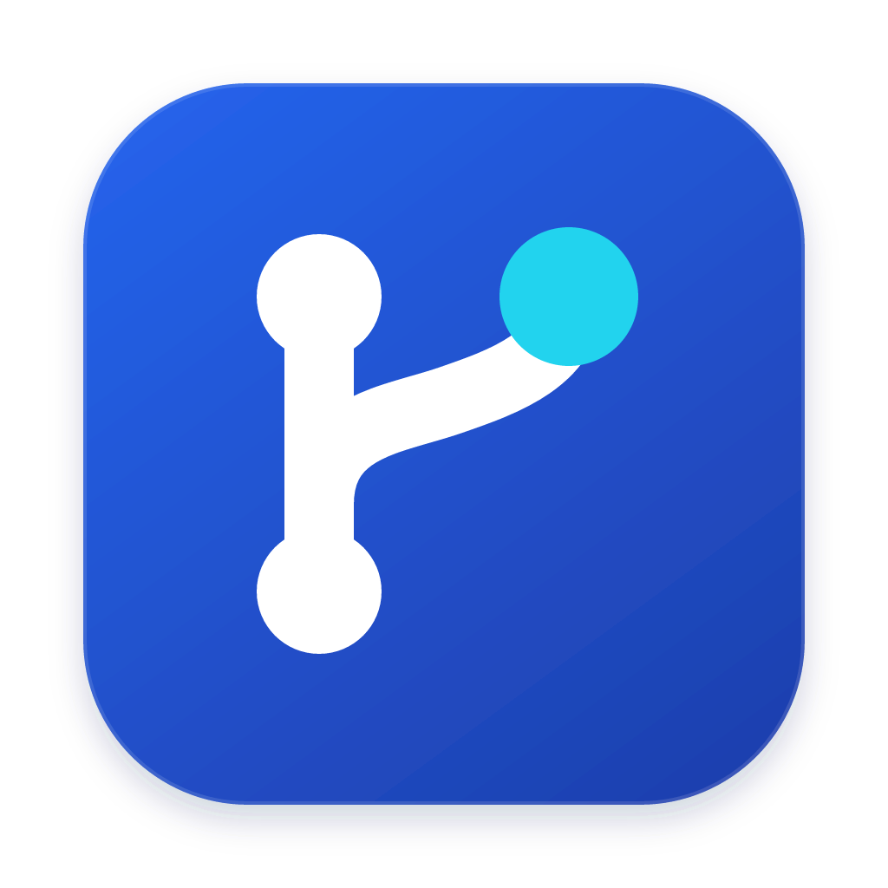

  

<h1 align="center">Alune</h1>

  <strong>在桌面上，统一管理本地与 SSH 远程 Git 仓库。</strong>

  查看差异、暂存提交、浏览历史、审阅 PR/MR，再打开仓库终端继续工作。 
  支持 macOS、Windows 和 Linux；安装即用，无需安装 Node.js 或单独启动后端。

  <a href="https://shaoclean.github.io/Alune/">官网</a> ·
  <a href="https://github.com/ShaoClean/Alune/releases/latest">下载安装</a> ·
  <a href="https://github.com/ShaoClean/Alune/issues/97">更新日志</a> ·
  <a href="#快速上手">快速上手</a> ·
  <a href="#核心功能">核心功能</a> ·
  <a href="https://github.com/ShaoClean/Alune/wiki">项目文档</a> ·
  <a href="https://github.com/users/ShaoClean/projects/1">公开 TODO</a>

从文件差异到暂存与提交，在同一个 Git 工作区完成。

[Alune-UI 文档](https://shaoclean.github.io/Alune/ui/) · [共享组件源码](packages/ui/README.md)

## 0.7.0 更新

- **仓库终端**：在本地、SSH 仓库或关联 Worktree 的目录中打开交互式 shell；多会话、可调整面板、切换仓库后继续工作。
- **更清晰的仓库身份**：工作区列表与标签共享紧凑的名称、来源及必要的短路径，详情可查看类型、分支和完整路径。
- **更专注的 PR/MR 审阅**：重新整理列表、详情和操作区域，突出描述、文件差异与讨论。

完整变更见 [v0.7.0 Release](https://github.com/ShaoClean/Alune/releases/tag/v0.7.0)。

## 核心功能

| 功能                    | 能力与操作入口                                                                                                                                     |
| ----------------------- | -------------------------------------------------------------------------------------------------------------------------------------------------- |
| **本地与 SSH 工作区**   | 打开本机 Git 仓库，或通过密码、私钥、SSH Agent 连接服务器并扫描登记仓库。本机与 SSH 共用差异、提交、历史和同步界面。                               |
| **文本与图片 Diff**     | 统一／分栏／全屏文本差异，支持代码主题、字体与字号；PNG、JPEG、GIF、WebP 支持前后图片对比。未跟踪新文件无需暂存即可预览。                          |
| **浏览文件**            | 按需加载目录树，以颜色和标记显示 Git 状态；只读预览带行号和高亮的代码、图片及 Markdown；逐行追溯作者和提交，支持跳转历史与父版本。右键提供适用的复制、暂存、取消暂存、放弃或删除等操作。     |
| **暂存与提交**          | 分别展示未暂存、已暂存内容；填写摘要和可选描述，提交已准备好的文件。批量放弃前先预览范围，保留已暂存内容，删除未跟踪文件须另行确认。               |
| **分支与同步**          | 创建、切换、重命名、安全删除和合并分支；切换远程分支时创建或复用本地跟踪分支。工具条提供拉取、推送、获取远程更新及首次推送的上游设置。             |
| **历史与储藏**          | 提交图展示已获取的本地分支、远程跟踪分支与标签，滚动加载历史并查看提交 Diff；支持查看、创建、应用、弹出和删除储藏。                                |
| **PR / MR 协作**        | 应用内查看 GitHub PR、GitLab MR 的详情、文件差异、评论和代码讨论；权限允许时发表普通／行号评论、合并或关闭。支持命名访问令牌和 HTTPS 自建 GitLab。 |
| **多标签与 Worktree**   | 标签可拖动排序、右键批量关闭，重启后恢复已打开仓库与顺序。本地可创建、打开和删除 Worktree；SSH 支持发现与打开已有 Worktree。                       |
| **仓库终端**            | 工具条“终端”或 `Ctrl+反引号` 打开面板，点击“新建”启动 shell；每窗口最多 8 个会话，切换视图或关闭仓库标签仍保留会话。关闭会话与退出应用有确认。     |
| **仓库数据总览**        | 仓库页可切换卡片、列表和总览，查看当前筛选范围的状态与活动数据；点击“采集统计”读取提交和语言统计，页面标注缓存时间与覆盖范围。                     |
| **AI 提交信息（可选）** | 配置 OpenAI、Anthropic、Gemini、DeepSeek 或兼容服务，根据已暂存差异起草可编辑的摘要和描述，由你确认后提交。                                        |
| **外观、布局与通知**    | 月光浅色／深色主题、跟随系统、减少动态效果；四款 Catppuccin 代码主题及 VS Code 主题 JSON／JSONC 导入；面板可隐藏、调宽，通知集中在底栏铃铛入口。   |
| **网络代理与更新**      | 配置 HTTP、HTTPS 或 SOCKS5 供 AI、版本更新、SSH 及远端 Git 同步使用；桌面版可检查、下载更新并重启安装。                                            |

工作区按**标签栏 → 仓库工具条 → 内容区 → 底部状态栏**组织。改动视图的中央为 Diff，右侧为文件与提交区；终端停靠在中央内容区底部。工具条平铺“改动｜文件｜提交历史｜分支｜储藏｜远程｜PR/MR”，并提供终端、刷新和同步入口。底部“工作区导航”可切换仓库、管理连接及打开设置。

<strong>查看深色工作区、文件阅读与提交历史</strong>

<strong>查看仓库终端、PR/MR 审阅与仓库总览</strong>

<strong>查看代码主题与网络代理设置</strong>

截图与操作说明按 **v0.7.0** 更新，使用该版本的真实网页界面、临时 Git 仓库、本机测试 SSH 服务与演示数据；PR/MR 的托管平台响应为测试数据。终端截图来自启用认证的隔离服务，命令在演示仓库实际执行。桌面窗口边框、系统对话框以实际平台为准。[截图基线与采集说明](https://github.com/ShaoClean/Alune/wiki/README-Screenshots-v0.7.0)

## 下载安装

前往 **[最新稳定版 Release](https://github.com/ShaoClean/Alune/releases/latest)**，在 Assets 中选择与你的系统和芯片匹配的安装包。

| 系统               | 选择的文件                           | 安装方式                                  |
| ------------------ | ------------------------------------ | ----------------------------------------- |
| macOS · Apple 芯片 | `Alune-<版本>-mac-arm64.dmg`         | 打开 DMG，将 Alune 拖入“应用程序”后启动。 |
| macOS · Intel 芯片 | `Alune-<版本>-mac-x64.dmg`           | 打开 DMG，将 Alune 拖入“应用程序”后启动。 |
| Windows · x64      | `Alune-<版本>-win-x64.exe`           | 运行安装程序，按提示选择安装位置。        |
| Linux · x64        | `Alune-<版本>-linux-x86_64.AppImage` | 允许文件作为程序执行，再运行 AppImage。   |

Release 提供 `SHA256SUMS` 供校验。当前安装包尚未配置平台签名，macOS 尚未公证，首次启动可能出现系统提示；安装与更新条件见[桌面端说明](docs/desktop.md)。已安装用户可在 **设置 → 版本更新** 检查、下载新版，完成后点击“重启安装”。

## 快速上手

本机和实际执行 Git 的远程主机需安装 Git；仓库目录需可读写，作者信息和同步凭据由执行 Git 的主机提供。

1. **打开仓库。** 在“仓库”页选择“打开本地仓库”。使用 SSH 时，在“连接”页添加连接并测试，再从“查看仓库 → 扫描并添加”登记远端仓库，点击“打开工作区”。
2. **检查并提交。** 在“改动”选择文件查看 Diff，暂存需要提交的内容，填写摘要和描述，点击“提交已暂存内容”。按需拉取或推送；只获取远程更新时，从推送旁的“更多推送选项”进入。
3. **打开终端。** 点击工具条“终端”，核对启动目录后“新建”。修改文件后用“刷新仓库”更新 Git 视图。切换仓库可回到各自的会话；收起面板不会结束进程。
4. **配置协作与网络。** 私有仓库先在“设置 → 访问令牌”保存命名令牌，再到“PR/MR”页选择并“应用到此仓库”。代理在“设置 → 网络代理”保存，已有 SSH 连接需“重新连接并应用”。
5. **按需启用 AI 与代码主题。** 在“AI 服务商”配置服务与模型，在“提交生成”保存默认模型，再使用提交摘要旁的星光按钮。“外观 → 代码阅读”可调整文件与文本 Diff 的主题、字体和字号。

常用快捷键：`Cmd/Ctrl+B` 切换左栏，`Cmd/Ctrl+Shift+B` 切换右栏，`Cmd/Ctrl+,` 打开设置，`Ctrl+反引号` 显示／收起终端，聚焦标签后用 `Alt+←/→` 调整顺序。

AI 会把已暂存差异发送给你配置的服务，不启用 AI 也可使用 Git 功能。关闭仓库标签保留登记、目录及运行中的终端；结束终端不会回滚文件修改，重启应用不会恢复终端进程。完整边界见[工作区使用说明](docs/workspace.md)。

## 文档与开发

| 我想了解…                                | 入口                                                                                |
| ---------------------------------------- | ----------------------------------------------------------------------------------- |
| 布局、Diff、历史、PR/MR、Worktree 与终端 | [工作区使用说明](docs/workspace.md)                                                 |
| 安装更新、数据目录与桌面行为             | [桌面端说明](docs/desktop.md)                                                       |
| AI 服务商、模型与密钥配置                | [AI 设置说明](docs/ai-settings.md)                                                  |
| 代理设置、生效时机与远端 Git 转发        | [网络代理说明](docs/network-proxy.md)                                               |
| 从源码运行、构建与测试                   | [开发与打包](docs/development.md)                                                   |
| 待发布变更和版本历史                     | [公开更新日志](https://github.com/ShaoClean/Alune/issues/97)                        |
| 提交规范、Git hooks 与版本发布           | [贡献与发布指南](CONTRIBUTE.md)                                                     |
| 功能设计、验收记录与截图                 | [GitHub Wiki](https://github.com/ShaoClean/Alune/wiki) · [文档索引](docs/README.md) |

## 反馈与贡献

欢迎通过 [Issue 模板](https://github.com/ShaoClean/Alune/issues/new/choose)报告问题、提出建议，也可以从[公开 TODO 看板](https://github.com/users/ShaoClean/projects/1)挑选任务。计划中的能力以 Issue 为准。

提交 PR 前请阅读[贡献指南](.github/CONTRIBUTING.md)，关联对应 Issue 并记录验证结果。设计、验收和配套截图统一维护在 Wiki，见[维护约定](https://github.com/ShaoClean/Alune/wiki/Contributing)与[迁移清单](https://github.com/ShaoClean/Alune/wiki/Migration-25)。
