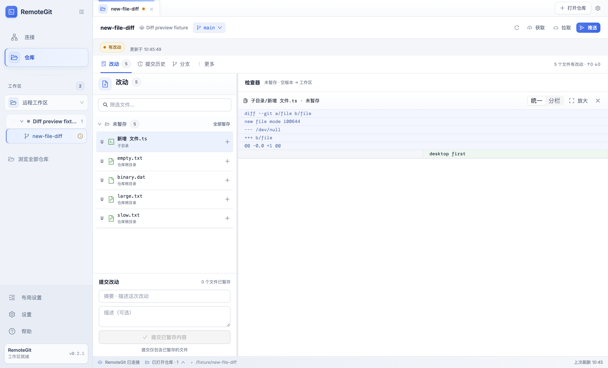

# Issue #18：新增文件差异预览

基线：`development@6c1e6be`。验证环境：macOS 15.5 arm64、Node.js 25.5.0、Git 2.43.1、Electron 44.2.0。所有测试使用隔离数据目录和临时仓库，没有使用已有连接或修改真实远端仓库。

## 行为与限制

- 未跟踪文件通过只读 `git diff --no-index` 与 `/dev/null` 比较。退出码 1 在产生差异时视为成功；文件在预检后消失造成的同码错误仍显示读取失败。
- 暂存预览使用索引中的实际内容，暂存后再次编辑的文件分别显示两条状态。未首次提交时，取消暂存只移除索引条目，保留工作区文件。
- 状态使用 NUL 分隔并展开未跟踪目录中的文件；路径采用 shell 单引号转义和 Git literal pathspec，覆盖中文、空格、引号、美元符号、反引号、括号、方括号、换行、制表符、反斜杠和前导连字符。
- 空文件、二进制文件、非 UTF-8 文本、超限文件、权限不足和文件消失各有对应反馈。SSH 输出最多 1 MiB，差异最多 10,000 行；未跟踪文件和索引 blob 也在生成差异前检查 1 MiB 大小限制。
- 切换文件、比较侧、仓库和关闭检查器时使旧请求失效。状态刷新后重新读取当前比较；历史提交和普通修改/删除仍使用 Git 的比较语义。

## 自动验证

| 检查                                                                                                             | 结果                     | 覆盖                                                                                                                                                                                     |
| ---------------------------------------------------------------------------------------------------------------- | ------------------------ | ---------------------------------------------------------------------------------------------------------------------------------------------------------------------------------------- |
| `npm test -w @remote-git/ssh-client`                                                                             | 12 项通过                | 回环 SSH 服务执行真实 Git；有/无 HEAD 的状态流、暂存快照、只读索引与文件字节检查、特殊路径、空/二进制/超限/编码/权限/消失、符号链接、普通修改/删除/重命名/历史、SSH UTF-8 分包及输出限额 |
| `npm test -w web`                                                                                                | 38 项通过                | 新增行解析、特殊内容不误认文件头、空/二进制提示、乱序成功/失败、关闭选择和仓库切换；既有前端用例                                                                                         |
| `npm test -w server -- --runInBand repository.controller.spec.ts git.service.spec.ts repository.service.spec.ts` | 8 项通过                 | 比较侧参数、读取失败反馈、暂存/取消暂存调用及仓库状态                                                                                                                                    |
| `npm run desktop:build`                                                                                          | 通过                     | 共享包、SSH 包、Web、服务端和 Electron 暂存应用                                                                                                                                          |
| `cd apps/desktop && node scripts/smoke.mjs`                                                                      | 写入和重启恢复两阶段通过 | 实际 Electron UI、统一/分栏/放大、暂存后编辑、取消暂存、异常提示、延迟返回、关闭选择；既有路由/认证/数据库/布局/更新回归                                                                 |
| `npm run test:hooks`                                                                                             | 22 项通过                | 既有 Git hooks 回归                                                                                                                                                                      |
| `npm run test:release-notes`                                                                                     | 4 项通过                 | 既有版本说明回归                                                                                                                                                                         |
| `npm run desktop:test:unit`                                                                                      | 37 项通过，1 项超时      | 既有原生 macOS DMG 升级测试在 60 秒后超时；在未修改的 `development@6c1e6be` 单独复测同样超时                                                                                             |

Electron 的新增界面用例使用可控 Git 响应来稳定覆盖异步状态，真实 SSH/Git 行为由 SSH 集成测试和下述 Web 验证覆盖。原生 DMG 超时的复测命令是 `node --test --test-name-pattern='macOS native DMG' apps/desktop/test/mac-installer.test.cjs`，未改动安装功能或忽略该测试。

## Web 实际链路验证

使用 ego-browser 访问本机构建的 Web 与 NestJS 服务，通过回环 SSH 连接隔离的 Git 仓库：

- `演示/新增 文件.ts` 未暂存时完整显示全部新增行；分栏左侧为空，放大窗口显示同一内容。
- 通过界面暂存后，在测试仓库中追加 `unstagedOnly`，刷新后显示已暂存与未暂存两条记录。已暂存比较不包含追加内容；未暂存比较显示追加内容。
- 取消暂存后自动更新预览，将整个当前文件显示为新增内容。
- 空文件、二进制、大文件分别显示对应提示。文件在列表加载后删除，点击时显示读取失败；刷新后清除失效选择。
- 切换到另一个空仓库后清除原预览；首次提交的历史 diff 正常显示。

## 开发模式启动回归

后续在 `npm run dev` 模式复现白屏：浏览器直接加载共享工作区的 CommonJS `dist/index.js`，报错缺少 `REPOSITORY_STATUS_REQUEST_TIMEOUT_MS` 导出。此前构建后的页面验证无法覆盖这个开发服务器差异。

已在 Web 的 Vite 配置中把 `@remote-git/shared` 映射到其 TypeScript 源码，让 Vite 转换为浏览器使用的 ES 模块，也避免前端启动依赖共享包预先构建。使用实际 Vite 开发服务复测连接页、仓库列表和刷新，并检查浏览器运行时异常；Web 构建和 38 项前端测试通过。

## 截图与未验证范围

截图来自隔离的 Electron UI 测试夹具。Web 的 DOM 和实际交互已验证，但本次浏览器截图接口超时，未将其列为截图证据。

未验证 Windows/Linux 桌面实机、真实网络 SSH 主机、安装包发布与升级。SSH 集成测试夹具需要 POSIX `/bin/sh`；运行环境没有该 shell 时应在 macOS/Linux 上执行这一组测试。
