# Issue #21 实现与验证

实现基于 `origin/development` 的 `6030c2c`，使用独立 worktree `remote-git-issue-21`、分支 `codex/issue-21-ai-commit-settings`。沿用 [Issue #21](https://github.com/ShaoClean/remote-git/issues/21) 已确认的浅蓝侧栏、独立设置页、服务商三栏结构、提交框内星光按钮和窄窗口逐级导航。

2026-09-15，macOS arm64、Node.js 25.5.0、Electron 44.2.0、Ego Lite / Chromium。功能验收使用隔离的 HTTP 模拟服务；Git 检查使用临时真实仓库或既有 smoke 数据，不操作用户远程仓库，不调用真实商业模型。后续 HTTP 423 排查对用户配置的服务做了最小 HTTP 请求对比，没有发送仓库内容或记录密钥；失败请求不计为真实模型连通性通过。

## 截图

截图为生产前端构建连接真实本地 API、临时 Git 仓库和模拟模型服务的运行结果。地址、仓库和配置均为测试数据。

| 场景                                          | 截图                                      |
| --------------------------------------------- | ----------------------------------------- |
| 已生成提交信息，保留撤销入口（1440 × 960）    | 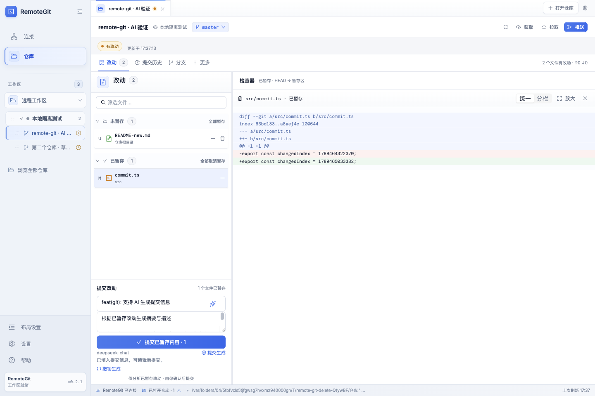           |
| AI 服务商列表、配置与模型（1440 × 960）       | 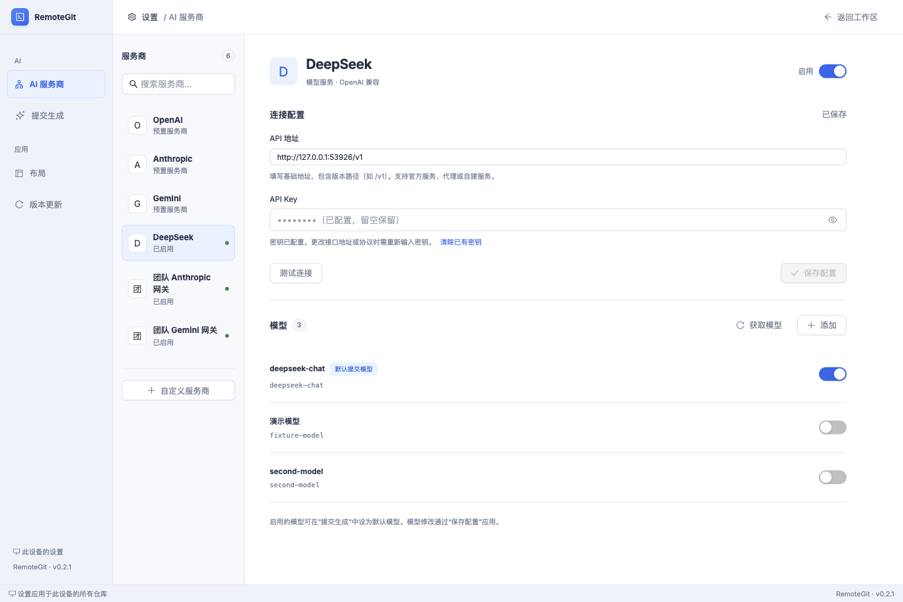         |
| 默认模型与生成偏好（1440 × 960）              | 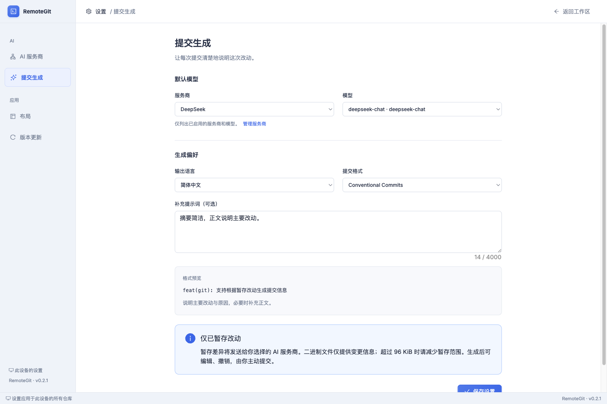 |
| 自定义 Anthropic 服务商与手动模型             | 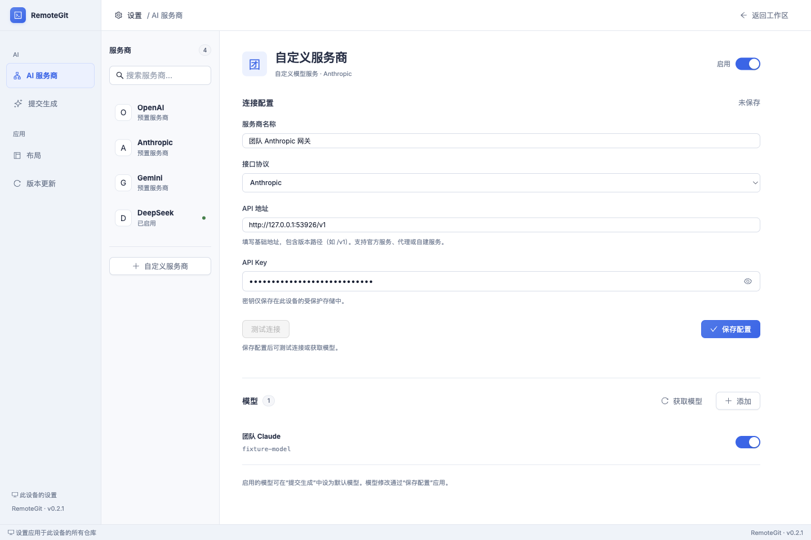 |
| 普通窗口（1000 × 760）                        | 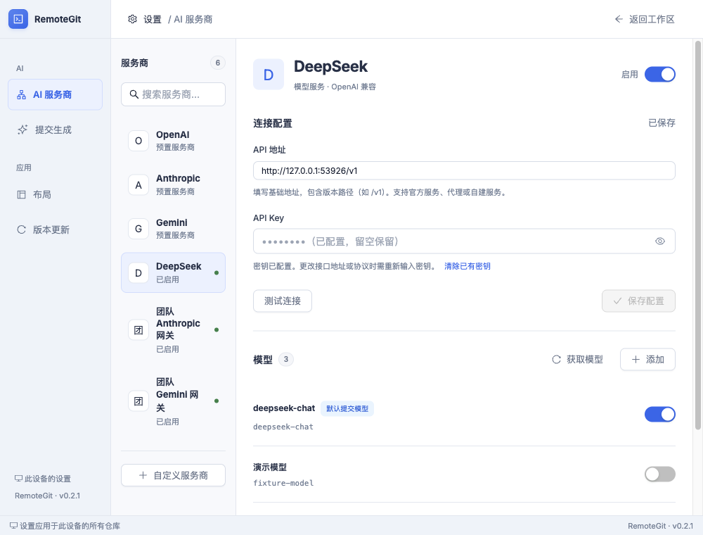         |
| 窄窗口服务商列表（390 × 844）                 | 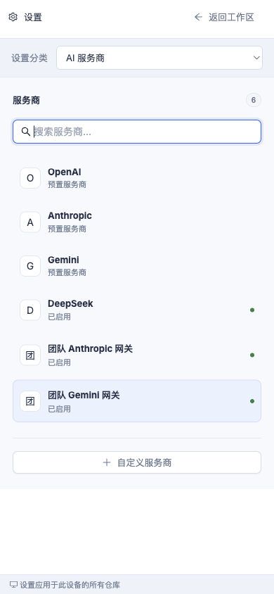   |
| 窄窗口服务商详情（390 × 844）                 | 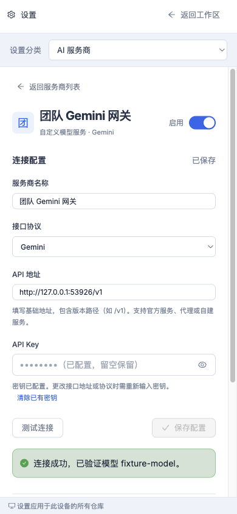        |
| 最小宽度提交生成设置（320 × 740，正文可滚动） |       |
| 独立服务手动输入 API Key 后连接成功（1200 × 860，无密钥环境变量） | 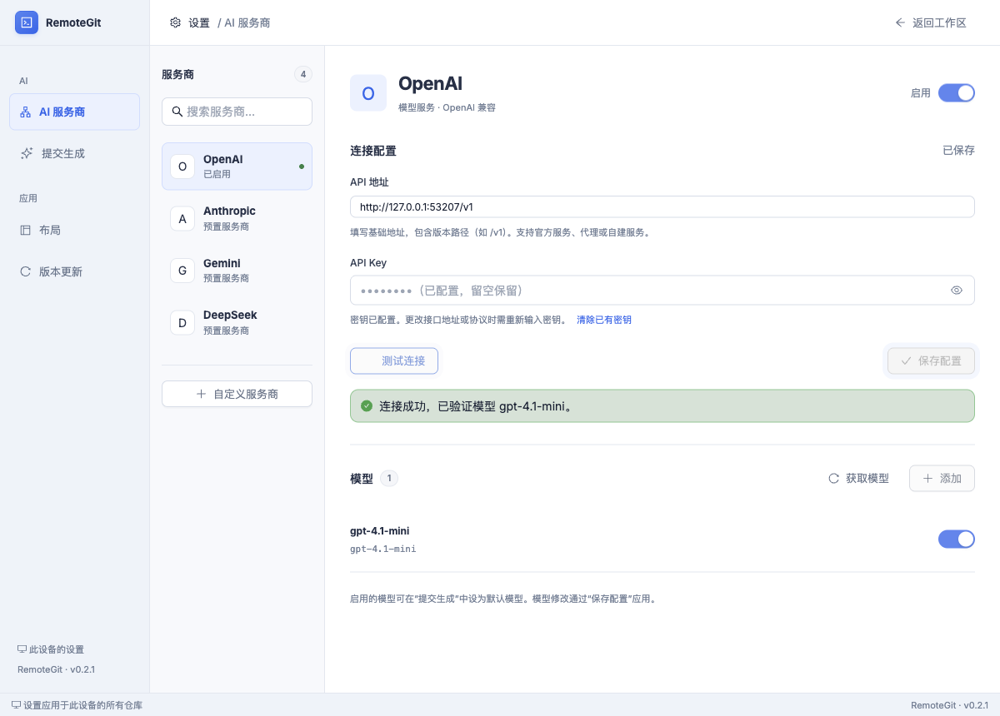 |
| 选择未启用模型进行连接测试（1502 × 724） | 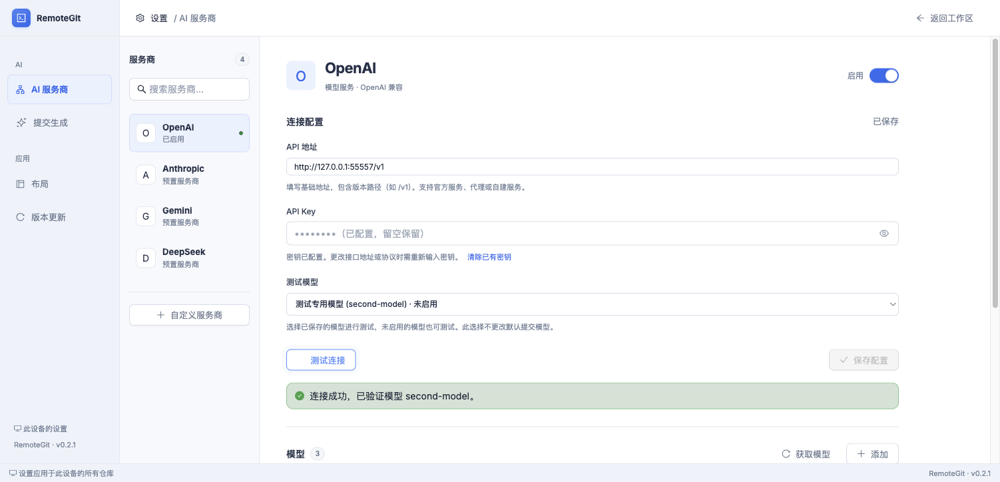 |
| 窄窗口选择测试模型并连接成功（390 × 844） | 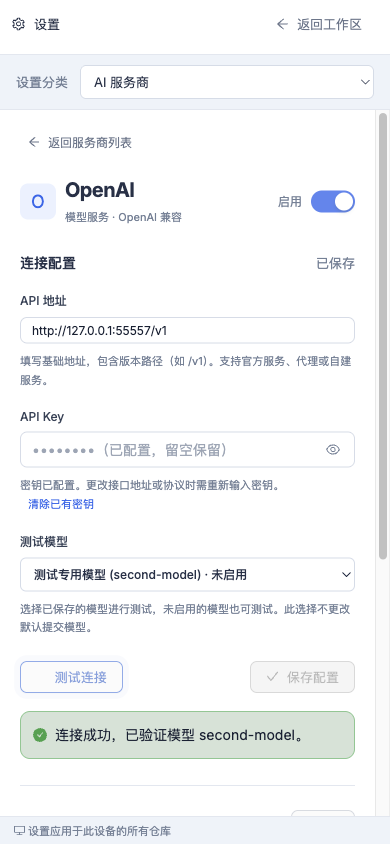 |

真实 Electron 窄窗口（390 px，Retina 2×）：

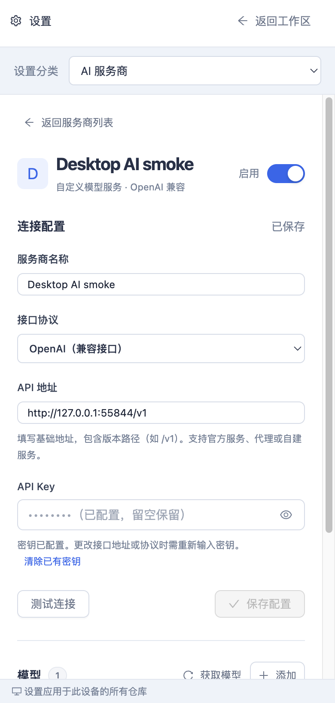

## 自动验证

| 检查                                       | 结果                                                                                                                                                                                      |
| ------------------------------------------ | ----------------------------------------------------------------------------------------------------------------------------------------------------------------------------------------- |
| `npm run desktop:build`                    | 共享类型、SSH 包、NestJS、前端及桌面 staging 全部构建通过；保留既有 Vite 大 chunk 提示                                                                                                    |
| `npm test -w web`                          | 44 项通过，包含 5 项新增 AI 草稿/默认模型测试                                                                                                                                             |
| 相关服务端 Jest                            | 58 项通过，覆盖配置持久化、自动本机密钥存储、手动密钥生效且无环境变量回退、三类协议及四个预置/三类自定义服务、显式选择测试模型、模型列表及分页、HTTP 423 拒绝访问提示及失败时保留配置、错误、取消、超时与暂存变化，以及现有仓库/Git 回归                                                 |
| SSH 包                                     | 47 项通过，1 项 Windows 专用检查在 macOS 跳过；新增 5 项真实 Git 验证覆盖混合改动、空分支、二进制、体积限制、取消、快照变化和提交字面值                                                   |
| AI 密钥/更新器/外链/工作区偏好桌面单元测试 | 28 项通过                                                                                                                                                                                 |
| Electron 两次独立启动 smoke                | 通过；指定未启用模型的连接测试使用正确的模型 ID；真实系统保护的密钥、默认模型及语言偏好跨进程恢复，前端不读取已保存密钥；390 px 原生窗口列表/详情、设置/布局、更新检查、离开设置继续下载、下载中刷新、重启安装按钮及后端关闭保持正常 |

相关服务端命令：

```sh
npm test -w server -- --runInBand --testPathPatterns='ai|git.service|new-file-deletion|repository|app.controller|connection.service'
```

完整服务端 Jest 仍有 4 个未改动的脚手架测试因缺少依赖注入 mock 失败：`connection.controller.spec.ts`、`file.controller.spec.ts`、`git.controller.spec.ts`、`file.service.spec.ts`。已在原工作区运行相同四个测试并复现；不将这些测试记为通过。

完整桌面单元测试中，既有 macOS 原生 DMG staging/替换/启动集成测试达到 60 秒时限。本次没有修改安装器实现；更新器单元测试及桌面 UI/下载/重启安装 smoke 已通过，原生 DMG 升级不记为已通过。

## 浏览器交互

- 独立服务在未配置任何 AI 密钥环境变量、未注入测试存储适配器时启动。通过页面输入 API Key、切换显隐、保存并测试连接成功；更换、清除和重新输入密钥均通过模拟服务的实际认证头校验。
- 第二个独立 Node 服务进程读取同一数据目录，无密钥环境变量也能恢复配置并通过认证；配置响应不含密钥明文或密文，配置文件为加密载荷，本机密钥文件权限为 `0600`，检查测试服务日志未发现输入的密钥。
- “测试模型”初始选择当前服务商的默认提交模型；选择另一个未启用模型后，模拟服务实际收到选定的模型 ID，默认提交模型及模型启用状态保持不变。选择“仅测试模型列表接口”可单独测试列表接口；切换服务商后不沿用上一个服务商的模型。390 px 下选择和测试正常，无整体横向溢出。
- 未配置 AI 时从星光按钮进入设置；返回后仓库、已选差异、原摘要和含空行的完整描述保留。
- 保存 DeepSeek 模拟配置，测试生成连接、获取模型；添加独立 Anthropic 与 Gemini 自定义服务，手动添加准确 ID、启停模型并保存；分别验证连接。
- 设置默认模型、中文 Conventional Commits 和补充提示词。后端实际请求只包含暂存版本，未暂存内容未发送。
- 生成后同时填入摘要/描述，撤销恢复原稿；再次生成与手动编辑有效，手动编辑后撤销入口收起。
- 取消、生成中编辑、进入设置、切换仓库均保留用户草稿；模拟服务记录到客户端请求实际中断。第二个仓库的独立草稿保持不变。
- 模拟 401 认证失败，错误可读、草稿保留、手动重试成功。
- 模型请求进行时直接重新暂存同一文件：服务端以 blob ID 变化检测到旧快照，返回 409，不填入旧结果。
- 从 UI 取消暂存全部内容后生成，明确提示先暂存；再次暂存与生成正常。
- 在临时真实仓库中点击提交，核对 Git 对象中的摘要/描述与生成草稿逐字一致，引号、`$()`、反引号和空行均保留，提交后草稿清空，未跟踪文件不被提交。
- 390 px 下列表/详情切换、搜索、分类选择可操作；320 px 下没有整体横向溢出。布局滑块支持键盘 End，恢复默认回到 340 px。
- 非桌面“版本更新”显示原有不支持说明，AI 与布局分类保持可用。

## 2026-09-16：模型编辑与删除

参考 [LobeHub 模型行内操作](https://github.com/lobehub/lobehub/blob/main/src/features/Settings/provider/features/ModelList/ModelItem.tsx)，在每行添加编辑、删除图标，保留启用开关。新增和编辑复用模型表单；操作先更新草稿，通过“保存配置”统一持久化。

生产前端连接隔离的本地 API 和模拟模型服务，浏览器验证通过：

- 修改名称保留默认选择；修改 ID 保留原启用状态，空名称使用 ID。重复、空白及含空格 ID 均被拦截，取消编辑不改动列表，取消添加后重新打开为空表单。
- 删除需要确认，默认模型的 ID 修改及删除均提示保存后的影响。保存后清空失效的默认引用，测试模型下拉框回退到有效项；刷新页面保留已保存的修改和删除。
- 模型操作在保存前不写入配置；模拟配置版本冲突时，页面保留未保存草稿，服务端保留原模型。重新加载可恢复服务端列表。
- 删除最后一个模型后显示空状态，测试模型切换为模型列表接口；再次主动获取时，上游仍返回的模型以停用状态重新加入。
- 1440 × 1000 和 320 × 740 下可完成编辑、保存、添加、删除，窄窗口列表及弹窗无横向溢出；编辑按钮支持键盘 Enter。删除确认按钮使用红色，避免被既有全局蓝色按钮样式覆盖。

| 场景 | 截图 |
| --- | --- |
| 编辑模型 | [宽窗口](model-edit-wide.png) · [320 px](model-edit-320.png) |
| 删除确认 | [默认模型](model-delete-wide.png) · [320 px](model-delete-320.png) |
| 行内编辑、删除及启停 | [320 px 模型列表](model-list-320.png) |

`npm run build -w web`、`npm run build -w server` 均通过；`npm test -w web` 为 44 项通过，`npm test -w server -- --runInBand --testPathPatterns=ai` 为 46 项通过。新增 3 项服务端回归覆盖删除、更改模型 ID 后清除默认选择并跨重启持久化，以及仅改名称或删除其他模型时保留默认选择。Vite 仍有既有的大 chunk 提示。本次未重新执行 Electron 或 Windows/Linux 原生界面验收。

## 2026-09-16：PR 提交前回归

在 macOS arm64、Node.js 25.5.0、Electron 44.2.0 上对当前完整改动重新验证：

| 检查 | 结果 |
| --- | --- |
| `npm run desktop:build` | 5 个构建任务全部通过；Vite 保留既有大 chunk 提示 |
| `npm test -w web` | 44 项通过 |
| 上述相关服务端 Jest 命令 | 9 个测试套件、61 项通过 |
| `npm test -w @remote-git/ssh-client` | 49 项通过；Windows 真实差异预览及 PowerShell 字节保真 2 项平台专用测试跳过 |
| AI 密钥、更新器、外链、工作区偏好桌面单元测试 | 28 项通过 |
| 在 `apps/desktop` 运行 `node scripts/smoke.mjs` | 两次独立启动通过，系统密钥存储可用，AI 配置及密钥跨进程恢复；窄窗口设置、差异预览、布局、更新下载及重启安装按钮回归通过 |

桌面单元测试命令：

```sh
node --test apps/desktop/test/ai-secret-storage.test.cjs apps/desktop/test/updater.test.cjs apps/desktop/test/external-links.test.cjs apps/desktop/tests/workspace-preferences.test.cjs
```

此次未重跑前文已记录失败的完整服务端脚手架测试及原生 DMG 安装集成测试，也未新增真实商业模型或 Windows/Linux 原生平台验证。截图与浏览器交互记录沿用前文验收结果。

## 复现

```sh
npm run build -w @remote-git/shared
npm run build -w @remote-git/ssh-client
npm run build -w server
npm run build -w web
node apps/server/test/ai-ui-fixture.cjs
```

打开输出的 `repositoryUrl`；`modelUrl` 可填入任意协议的测试服务商基础地址，密钥使用任意测试值。模拟控制接口 `controlUrl` 支持 JSON `{"mode":"slow"}`、`{"mode":"auth"}`、`{"mode":"empty"}`、`{"mode":"no-models"}`、`{"mode":"success"}` 和 `{"restage":true}`。只绑定 loopback，结束时清除它创建的临时仓库与数据目录。

验证手动密钥时可向控制接口发送 `{"expectedApiKey":"测试值"}`，模拟服务会校验后续请求的认证头，控制响应只返回 `authenticated` 布尔状态。独立服务使用生产环境的自动本机密钥存储，无需设置密钥环境变量。

桌面完整 staging 后在 `apps/desktop` 运行 `node scripts/smoke.mjs`，由脚本创建两个隔离桌面进程。可设置 `REMOTE_GIT_AI_SMOKE_SCREENSHOT` 保存真实窄窗口截图。本机复用了原工作区中相同版本的 Electron 可执行文件；生产构建仍来自本 worktree。

未执行真实 OpenAI/Anthropic/Gemini/DeepSeek 账号调用、Windows/Linux 原生密钥存储与安装包验收、Windows 远程 shell 的实际提交，或用户远程仓库写操作。协议、分页、错误和 Windows 参数编码由模拟服务/单元测试覆盖；实际兼容性仍需对应服务账号与平台验证。
